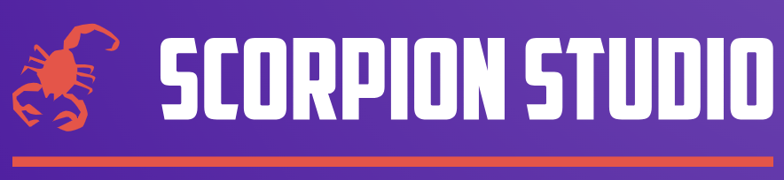
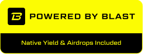

# Blasteens Subgraph
<p align="center">
  
</p>
The Blasteens Contracts upholds fairness within the community, with its transparency ensuring that both gamers and developers reap benefits. This includes visibility into the prize reward system, lotto system, and rewards for developers, all of which are essential for enhancing the ecosystem. The details of any contract are openly accessible to everyone.
<br><br>

> Want to know more? <br>
> 👉 [Blasteens' READMD.md](https://github.com/future-web3/blasteens-ui) 👈

> Be more comfy watching an intro video?<br>
> 👉 [Blasteens' Youtube Video](url) 👈

## Table of Contents
* [Features](#features)
* [Tech Stack](#tech-stack)
* [Contract Addresses](#contract-addresses)
* [How to Contribute?](#how-to-contribute)
* [License](#license)
* [Developed By](#developed-by)

## Features:
 - Utilised all the blast l2 features including yield claim, gas claim etc.
 - Utilised pyth VRF to get randomness for Lotto Draw.
 - Utilised various of other solidity patterns such as factory etc..

## Tech Stack
 - Blast yield mechanism.
 - Blast gas mechanism.
 - Pyth VRF.
 - Subgraph on blast.
 - Foundry as the dev framework.

## Contract Addresses:
```javascript
gameTicketContract: '0x3c1F70e4af2E1693e89Bed7B24f497d8b0b0dB43',
gameContract: {
      escapeFromGerms: '0xdC29E420FbaF9c273d84B5a6548a7936a7ccdb9e',
      tommyJumping: '0xCeB7dA77A08364AD614460E1Fa19782Cf1C6765a',
      snowmanDefender: '0x1e68ED8a770D439300b6a6Ada4082Dd46174dB2C',
      emojiMatch: '0x35Fa871534e1B452DD9Ef25aD597FD9FBaA6334d'
},
forwarderContract: '0xB6A87320DE35F2bEFE2258162360daa3de11C788',
lottoContract: '0xe1087eaE2147563d06f8870469bC022C94233f72',

```

## How to contribute
We warmly invite developers of all skill levels to contribute to our open-source project, whether through code, documentation, or community support, to help us build something truly amazing together.

## License
The MIT License (MIT)
<br>
<br>
[](https://opensource.org/licenses/MIT)

Copyright (c) 2024 The Scorpion Studio

Permission is hereby granted, free of charge, to any person obtaining a copy of this software and associated documentation files (the "Software"), to deal in the Software without restriction, including without limitation the rights to use, copy, modify, merge, publish, distribute, sublicense, and/or sell copies of the Software, and to permit persons to whom the Software is furnished to do so, subject to the following conditions:

The above copyright notice and this permission notice shall be included in all copies or substantial portions of the Software.

THE SOFTWARE IS PROVIDED "AS IS", WITHOUT WARRANTY OF ANY KIND, EXPRESS OR IMPLIED, INCLUDING BUT NOT LIMITED TO THE WARRANTIES OF MERCHANTABILITY, FITNESS FOR A PARTICULAR PURPOSE AND NONINFRINGEMENT. IN NO EVENT SHALL THE AUTHORS OR COPYRIGHT HOLDERS BE LIABLE FOR ANY CLAIM, DAMAGES OR OTHER LIABILITY, WHETHER IN AN ACTION OF CONTRACT, TORT OR OTHERWISE, ARISING FROM, OUT OF OR IN CONNECTION WITH THE SOFTWARE OR THE USE OR OTHER DEALINGS IN THE SOFTWARE.

## Developed By
- Blasteens is developed by _The Scorpion Studio_. \
We're a dynamic developer team based in Melbourne, Australia, deeply fascinated by all aspects of dApps. With a firm belief in the future potential of blockchain technology, we are committed to exploring and contributing to this innovative field. Peace ✌️
  <p align="left">
    
  </p>
- Also, special thanks to _[Blast](https://blast.io/en)_ !
  <p align="left">
    
  </p>
